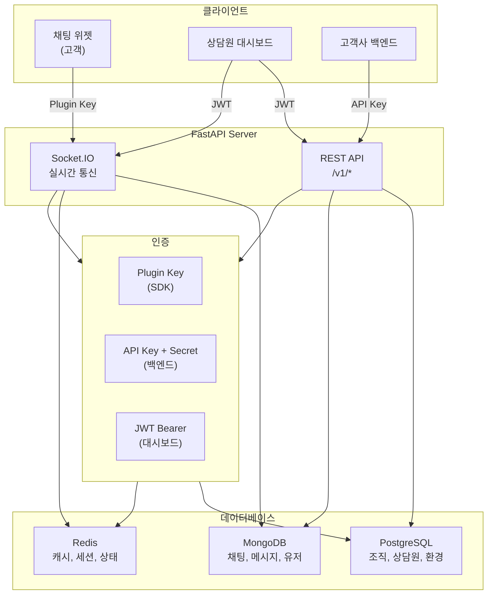

# Fast Light Chat

[](https://python.org)
[](https://fastapi.tiangolo.com)
[](LICENSE)

> 경량 고성능 실시간 채팅 상담 플랫폼 (채널톡 스타일)

**목표**: 10,000명 동시 접속, 모든 응답 150ms 이하

## Features

- **실시간 채팅**: Socket.IO 기반 양방향 통신
- **멀티테넌시**: 조직별 완전 분리된 데이터
- **3가지 인증**: Plugin Key (SDK), API Key (백엔드), JWT (대시보드)
- **경량화**: 최소한의 의존성, 최적화된 DB 연결 풀링

## Architecture



## Tech Stack

| Category | Technology |
|----------|------------|
| Backend | FastAPI (Python 3.13) |
| Realtime | python-socketio |
| Database | PostgreSQL, MongoDB |
| Cache | Redis |
| Package Manager | uv |

## Quick Start

### Prerequisites

- Python 3.13+
- Docker & Docker Compose
- [uv](https://github.com/astral-sh/uv) (recommended)

### Installation

```bash
# 1. Clone repository
git clone https://github.com/your-username/fast-light-chat.git
cd fast-light-chat

# 2. Start databases
docker-compose up -d postgres mongo redis

# 3. Install dependencies
uv sync

# 4. Setup environment
cp .env.example .env
# Edit .env with your settings (especially JWT_SECRET_KEY!)

# 5. Run migrations
uv run alembic upgrade head

# 6. Seed demo data (optional)
uv run python scripts/seed_data.py

# 7. Start server
uv run uvicorn app.asgi:app --reload
```

### Access

| Service | URL |
|---------|-----|
| API Docs (Swagger) | http://localhost:8000/docs |
| API Docs (ReDoc) | http://localhost:8000/redoc |
| Chat Widget | http://localhost:8000/widget |
| Agent Dashboard | http://localhost:8000/dashboard |
| Health Check | http://localhost:8000/health |

## Project Structure

```
fast-light-chat/
├── app/
│   ├── main.py              # FastAPI application
│   ├── asgi.py              # ASGI + Socket.IO integration
│   ├── core/                # Config, security, exceptions
│   ├── db/                  # Database connections
│   ├── dependencies/        # FastAPI dependencies (DI)
│   ├── middlewares/         # HTTP middlewares
│   ├── domains/             # Domain modules (DDD)
│   │   ├── auth/            # Authentication
│   │   ├── organization/    # Organizations (tenant)
│   │   ├── environment/     # Environments & API keys
│   │   ├── agent/           # Support agents
│   │   ├── user/            # End users
│   │   └── chat/            # Chats & messages
│   └── sockets/             # Socket.IO namespaces
├── frontend/                # Demo frontend
├── tests/                   # Test suites
├── alembic/                 # Database migrations
└── scripts/                 # Utility scripts
```

## Authentication

| Target | Method | Header |
|--------|--------|--------|
| SDK (Customer) | Plugin Key | `X-Plugin-Key` |
| Backend Integration | API Key + Secret | `X-API-Key` + `X-API-Secret` |
| Dashboard (Agent) | JWT Bearer | `Authorization: Bearer {token}` |

## Development

### Running Tests

```bash
# All tests
uv run pytest

# With coverage
uv run pytest --cov=app

# Specific test suite
uv run pytest tests/unit/
uv run pytest tests/integration/
uv run pytest tests/e2e/
```

### Code Quality

```bash
# Linting & formatting
uv run ruff check .
uv run ruff format .

# Type checking
uv run mypy app/

# Pre-commit hooks
uv run pre-commit install
uv run pre-commit run --all-files
```

### Docker

```bash
# Development
DOCKER_BUILDKIT=1 docker build --target development -t fast-light-chat:dev .

# Production
DOCKER_BUILDKIT=1 docker build --target production -t fast-light-chat:prod .

# Run all services
docker-compose up -d
```

## Configuration

See [.env.example](.env.example) for all available environment variables.

Key settings:
- `JWT_SECRET_KEY`: **Must change in production!**
- `POSTGRES_*`: PostgreSQL connection
- `MONGODB_URL`: MongoDB connection
- `REDIS_URL`: Redis connection

## Performance Targets

| Metric | Target | Current |
|--------|--------|---------|
| API Response (p95) | < 150ms | TBD |
| Message Delivery | < 200ms | TBD |
| Concurrent Users | 10,000+ | TBD |
| Throughput | 1,000+ msg/s | TBD |

## Contributing

1. Fork the repository
2. Create your feature branch (`git checkout -b feature/amazing-feature`)
3. Commit your changes (`git commit -m 'Add amazing feature'`)
4. Push to the branch (`git push origin feature/amazing-feature`)
5. Open a Pull Request

## License

This project is licensed under the MIT License - see the [LICENSE](LICENSE) file for details.
